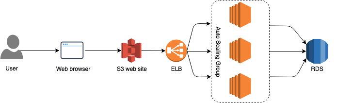
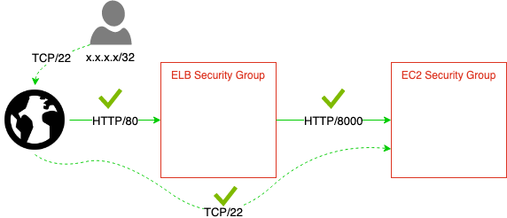

# Let's wrap it up
We already deployed such resources as:
- S3 Buckets
- EC2 Instance
- RDS Instance

But that's not enough for highly available applications.
Ok, let's pull all the stuff together and create something really great.

## Follow-up activities
There is one more repository which is created for this workshop:
- [Golang backend application](https://github.com/99stealth/cfn-workshop-backend)

Now your final task sounds like:
1. Create Security Groups
2. Create a RDS instance with MySQL (Actually you did that in `Chapter 4`)
3. Create a Classic LoadBalancer
4. Instead of single EC2 instance which you were creating in `Chapter 2` you need to create AutoScaling Group with at least 2 instances
5. Create `Mapping` per region with AMI which is `ami-035b3c7efe6d061d5` in `us-east-1`
6. Attach AutoScaling Group to LoadBalancer
7. Create IAM Role and Instance profile for instances from AutoScaling group. Thould have assigned Role which allows access to:
   - s3:GetObject
   - s3:DeleteObject
   - s3:PutObject
   - s3:ListBucket
8. When instance starts it should execute UserData from `UserData.sh`
   - Variables `DbUser`, `DbName`, `DbPort`, `DbPasswd` should be taken from `Parameters`
   - Variable `DbHost` shoulb be taken from RDS Instance Attribute (`Fn::GetAtt` `Endpoint.Address`)
9. LoadBalancer's DNS Name should be available in the `Output` of stack
10. Create `Metadata` with block type `AWS::CloudFormation::Interface` for better user experience

### Number of resources
- Security Groups:
  - EC2 Security Group
  - ELB Security Group
  - RDS Security Group

- Autoscaling:
  - Launch Configuration
  - Autoscaling Group

- LoadBalancer

- RDS Instance

- IAM
  - Role
  - Instance Profile


### Security restrictions
- You are allowed to connect to application only via LoadBalancer which is listening on port 80
- You are allowed to connect to instances only from one IP address
- Connection to application is allowed only from ELB's Security Group



## How to verify that application works in a right way
1. Open your terminal and run
```
curl --request POST --form firstname=Elon --form lastname=Musk --form email=emusk@tesla.com http://development-cfn-workshop-elb-941008924.us-east-1.elb.amazonaws.com/api/add-user
```
2. If you didn't get any error then go to MySQL database and check if data you provided exists

## Congratulations :tada:
That's all. I hope you enjoyed the workshop. Feel free to fork it and extend. Please let me know if there is anything that you would like to change in this course. If this workshop was useful for you then :star: the repo!

Thank you!